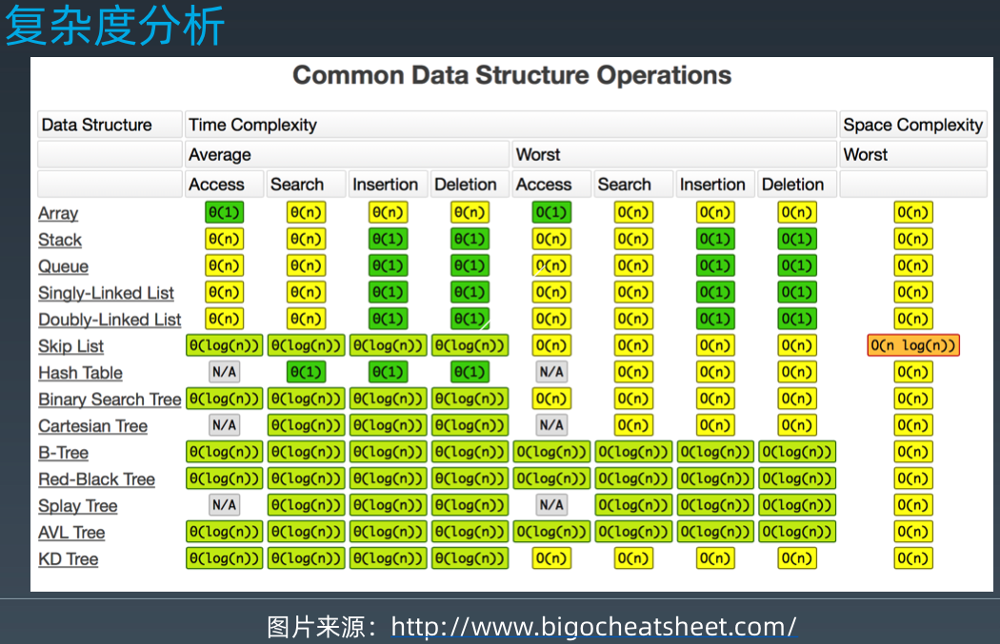

##### 第一周 自我总结

这周主要学习的内容有：

- 数组 
- 链表
- 跳表 
- 栈 
- 队列 

这五中数据结构，期中，队列中又学习了 
- 队列 
  - 优先队列
  - 双端队列


期中：

- 数组 适合查找操作，特别适合使用下标进行查找：大致原因如下：数组的特点是分配一块连续的内存空间，在内存寻址上，只需要记住首地址即可，然后通过下标便宜，进行访问，这就成就了数组的下标访问元素的时间复杂度是 O(1),二插入删除操作则需要移动元素，所以时间复杂度是 O(n)
  
- 链表 在内存分配上是不需要连续的空间，但是需要额外的一个空间来指向下一个节点的位置，这个空间成为 next指针，链表在插入删除操作上只需要调整前节点和当前节点就好，所以时间复杂度是 O(1)，而查找的，则需要遍历整个链表，所以时间复杂度是 O(n)，以上所述的链表是单链表，只有一个next指针，如果在添加一个prev指针的话，就变成了一个双向链表.
- 双向链表的插入删除操作的时间复杂度是 O(1),查找操作是单链表的一半的时间复杂度度 O(n)/2 也是记做 O(n),双向链表是典型的空间换时间的思想。使用多一个的 prev指针，来换取一半的查询时间。当然 跳表也是这种空间换时间的思想。

- 跳表的前驱条件是有序的单链表，在单链表上，每隔一定的节点数，抽出一层来当做索引, 然后在查找时，先通过索引层定位到某一段上，然后在该段上进行查询，时间复杂度是 O(logn),空间复杂度是 O(n)

- 栈是一种先进后出的数据结构 FILO， 可以用数组来实现，也是用链表来实现
- 栈是一种先进先出的数据结构 FIFO， 可以用数组来实现，也是用链表来实现

##### 结合实际开发的感想

- 数组可能是目前用的最多的一种数据结构，在开发过程中，使用的频率非常高，所以，对一些数组的api的时间复杂度需要有明确的认识：

- 链表常在一些缓存的三方库里面，比如说 YYCache就是使用的双向链表，同时还是用了 Hash表来存储一份数据，来把对象的查找时间复杂度降低成 O(1)

- 栈的话，常说的方法调就是使用这个数据结构，在方法调用完之后，栈上面申请的内存和临时变量，就会被推出栈，直接进行释放，而在堆上的内存则遵循内存管理

- 队列 在工程中用的也是非常多。
  - 在iOS中，有
  - 主队列，对应的是主线程，这个队列是串行的，
  - 全局并发队列，这里面就有 4个优先级的线程，
    - DISPATCH_QUEUE_PRIORITY_HIGH:       =  QOS_CLASS_USER_INITIATED
    - DISPATCH_QUEUE_PRIORITY_DEFAULT:    =  QOS_CLASS_DEFAULT
    - DISPATCH_QUEUE_PRIORITY_LOW:        =  QOS_CLASS_UTILITY
    - DISPATCH_QUEUE_PRIORITY_BACKGROUND: =  QOS_CLASS_BACKGROUND
    - 
后面的这些是自定义线线程的优先级，还有一些如下：
  - QOS_CLASS_USER_INTERACTIVE: 用于处理用户交互操作，异步用于主线程
  - QOS_CLASS_USER_INITIATED: 用于处理用户需要立即返回结果的操作，如用户点击的文件
  - QOS_CLASS_DEFAULT: 默认优先级
  - QOS_CLASS_UTILITY: 处理需要一些时间又不需要立即返回结果的操作，异步操作，例如下载、导入数据
  - QOS_CLASS_BACKGROUND: 处理特别耗时的操作：例如 同步数据、备份数据
```c++
__QOS_ENUM(qos_class, unsigned int,
	QOS_CLASS_USER_INTERACTIVE = 0x21,
	QOS_CLASS_USER_INITIATED   = 0x19,
	QOS_CLASS_DEFAULT          = 0x15,
	QOS_CLASS_UTILITY          = 0x11,
	QOS_CLASS_BACKGROUND       = 0x09,
	QOS_CLASS_UNSPECIFIED      = 0x00,
);
```
除了 GCD之外，NSOperationQueue也是使用使用队列，当OperationQueue的最大并发数超过1时，就是一个并发队列，为1时，就是一个串行队列。当然，每个加入到这个队列中的人任务对象是一个一个的NSOperation，这个是一个抽象类，需要使用其子类或者自定义子类，在这个上面就可以指定每个 Operation的优先级
```c++
typedef NS_ENUM(NSInteger, NSOperationQueuePriority) {
	NSOperationQueuePriorityVeryLow = -8L,
	NSOperationQueuePriorityLow = -4L,
	NSOperationQueuePriorityNormal = 0,
	NSOperationQueuePriorityHigh = 4,
	NSOperationQueuePriorityVeryHigh = 8
};
```
除此之外，如果自定义 NSOperation 的话，在重新 mian 方法时候，不需要自己维护每个任务的 cancelled、executing、finished状态，在重新了main方法和start方法后，就需要自己维护这些状态
状态的可控性也是 NSOperationQueue 和 GCD的一个很大的区别
这个也相当于 优先队列了

队列还想到了一个 NSNotificationQueue,可以调用 dequeue和enqueue
```c++
- (instancetype)initWithNotificationCenter:(NSNotificationCenter *)notificationCenter NS_DESIGNATED_INITIALIZER;

- (void)enqueueNotification:(NSNotification *)notification postingStyle:(NSPostingStyle)postingStyle;
- (void)enqueueNotification:(NSNotification *)notification postingStyle:(NSPostingStyle)postingStyle coalesceMask:(NSNotificationCoalescing)coalesceMask forModes:(nullable NSArray<NSRunLoopMode> *)modes;

- (void)dequeueNotificationsMatching:(NSNotification *)notification coalesceMask:(NSUInteger)coalesceMask;
```
```c++
typedef NS_OPTIONS(NSUInteger, NSNotificationCoalescing) {
    NSNotificationNoCoalescing = 0,       ：不合并通知。   
    NSNotificationCoalescingOnName = 1,   ：合并相同名称的通知。
    NSNotificationCoalescingOnSender = 2  ：合并相同通知和同一对象的通知
};
```
```c++
typedef NS_ENUM(NSUInteger, NSPostingStyle) {
    NSPostWhenIdle = 1, ：空闲发送通知 当运行循环处于等待或空闲状态时，发送通知，对于不重要的通知可以使用。
    NSPostASAP = 2,：尽快发送通知 当前运行循环迭代完成时，通知将会被发送，有点类似没有延迟的定时器。
    NSPostNow = 3 同步发送通知 如果不使用合并通知 和postNotification:一样是同步通知。
};
```
```c++
验证 通知是同步的，切遵循，先注册的先收到通知，先处理事情 FIFO
- (void)viewDidLoad {
    [super viewDidLoad];
    // Do any additional setup after loading the view.
    dispatch_after(dispatch_time(DISPATCH_TIME_NOW, (int64_t)(5 * NSEC_PER_SEC)), dispatch_get_main_queue(), ^{
        TestForView *sview = [[TestForView alloc] initWithFrame:CGRectMake(60, 60, 60, 60)];
        sview.backgroundColor = [UIColor orangeColor];
        [self.view addSubview:sview];
    });
    
    [[NSNotificationCenter defaultCenter] addObserver:self selector:@selector(didreceive) name:@"ViewController_no" object:nil];
    AppDelegate *delegate = (AppDelegate *)[UIApplication sharedApplication].delegate;
    [delegate addobserver];
}

- (void)didreceive {
    printf("---------- B %s \n", [[[NSThread currentThread] description] UTF8String]);
}

- (void)touchesBegan:(NSSet<UITouch *> *)touches withEvent:(UIEvent *)event {
    
    dispatch_async(dispatch_get_global_queue(0, 0), ^{
        printf("---------- A  %s \n", [[[NSThread currentThread] description] UTF8String]);
        [[NSNotificationCenter defaultCenter] postNotificationName:@"ViewController_no" object:nil];
        printf("---------- C %s \n", [[[NSThread currentThread] description] UTF8String]);
    });

    [self.nextResponder touchesBegan:touches withEvent:event];
}
```

回到数据结构与算法课程，
需要牢记下面的一些时间复杂度:
