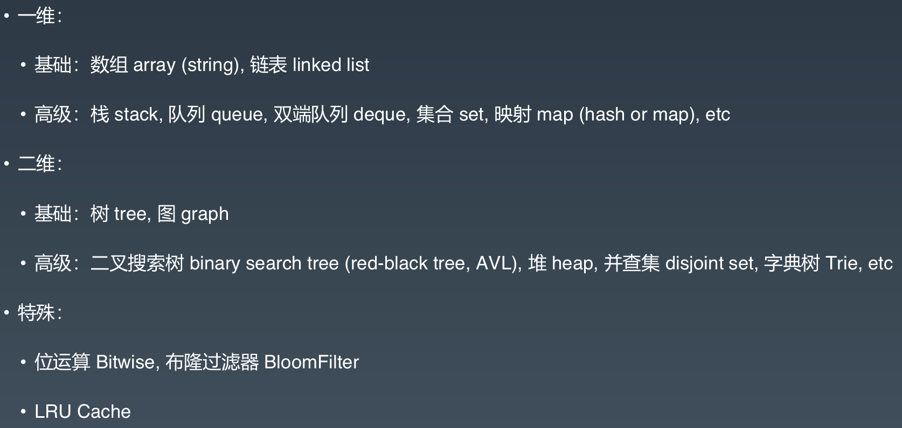
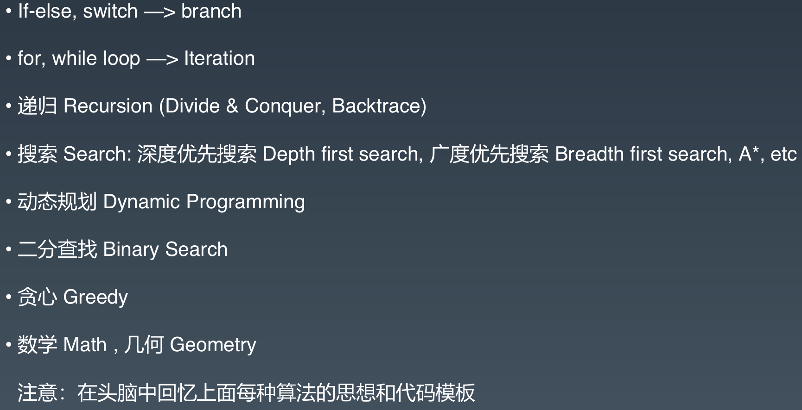
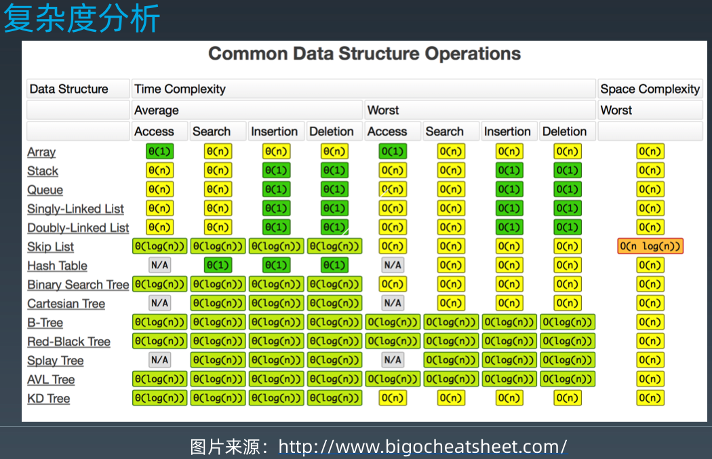

#### 期末总结
  这周过后，意味着算法训练营就正式结束了，这是一个结束，也是一个开始。
在没参加训练营之前，自己刷题之路走的异常坎坷，很多时候都是刷刷停停，对一些数据结构的认知也不够准确，这个课程对我的帮助很大：不管是知识层面，还是编码简洁层面。
 
在开讲之前，超哥跟我们分享了高效学习的一些方法点：
- 不要死磕代码，要使用五毒神掌来学习，要养成看高手代码的习惯，
- 刷题的最佳方式：5分钟想不出来，就直接看题解或者高票代码，把五毒神掌运用起来，把这些东西变成自己的，切记死磕
- 刷完题一定要用五毒神掌过遍数，不要AC了就了事，还需要寻求反馈，就是看高票的、高质量的题解

这些点，在超哥的直播和录播中，都强调过很多遍，期中，最低的限度就是刷4遍题，然后改写代码，越简洁越好，

在第一周中，我学习到一些数据结构：

还有一些算法

不管是在课程中，还是在课外，都需要进行刻意练习，练习缺陷、弱点的地方，还需要检查，每一次的不舒服，不爽，觉得枯燥，在练习完之后，这个都是一个提升，也只要勇于走出舒适区，才能够锻炼自己，提升自己
```
刷题技巧谨记
- 切题四件套
  - 确认题目意思
  - 尽可能想出更多的解，并在时间和空间中寻找最优解
  - 开始编码
  - 编写测试用例

数组和链表：
数组在内存分配上是连续的内存空间
链表不是连续的内存空间，通过更多的空间指向进行统一起来
```
下面是一些时间复杂度统计表

里面的一些数据结构也是非常非常常用的，这些都需要记下来，通常只需要记住平均时间复杂度就好

链表的一些常见算法题，是需要记一下的，每次面试前都需要练习一下，不然很容易出错
```swift 
func reverse(_ node: ListNode?) -> ListNode? {
    if node == nil || node?.next == nil {
        return node
    }
    let res = reverse(node?.next)
    node?.next?.next = node
    node?.next = nil
    return res
}

func detectCycle(_ head: ListNode?) -> ListNode? {
    guard head != nil && head?.next != nil else {
        return nil
    }
    var slow = head, fast = head, next = head
    
    while slow != nil && fast != nil {
        slow = slow?.next
        fast = fast?.next?.next
        if slow === fast {
            while next !== slow {
                slow = slow?.next
                next = next?.next
            }
            return next
        }
    }
    return nil
}
```


